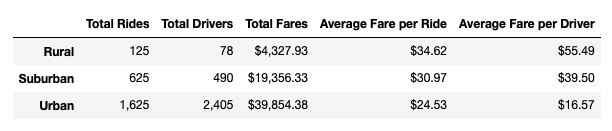
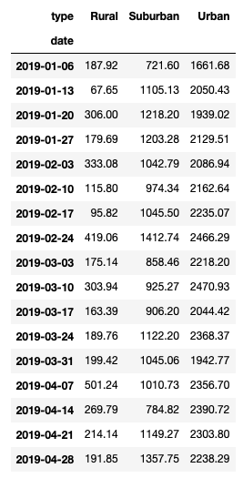
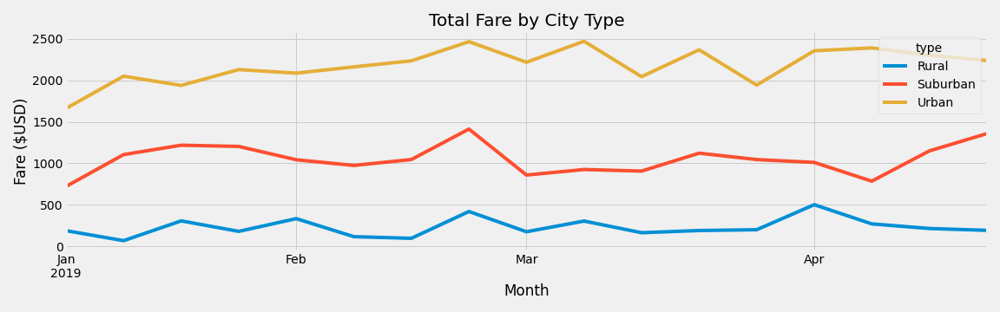

# PyBer_Analysis

## Overview
After creating a summary DataFrame from the PyBer data, we are creating a multiple-line graph that shows the total weekly fares for each city type. The graph will be used to summarize how the data differs by city type and how those differences can be used by decision-makers at PyBer.

## Results
*PyBer Summary By City Type* demonstrates that Urban cities have significantly more rides, drivers, and total fares than Suburban and Rural cities. However, when the Average Fare per Ride and Average Fare per Driver are calculated, the averages are lowest in Urban cities and highest in Rural.

|  |
| :--:|
| *PyBer Summary By City Type* |

 *PyBer Weekly Fare By City Type* gives us a chart view of each city type's weekly fare totals between January 1st, 2019 and April 28, 2019. *PyBer Fare Summary By City Type* provides a visualization of the same information. The line graph makes it easy to see that the weekly total fare in Urban cities is consistently higher than Suburban which is higher than Rural weekly total fares. In late February, all City Types had a slight uptick in Weekly Fare Totals during the week ending February 24.

|  |
| :--: |
| *PyBer Weekly Fare By City Type* |

|  |
| :--: |
| *PyBer Fare Summary By City Type* |

## Summary
To address disparities among the city types, I would recommend:

1. Provide incentives to potential Rural drivers to increase the total count and bring the average fare per ride down for customer satisfaction.
2. Provide bonuses to Urban drivers since their average fare is significantly lower than drivers in Suburban and Rural areas.
3. Use surge pricing during the last week of February to capitalize on the increased volume.